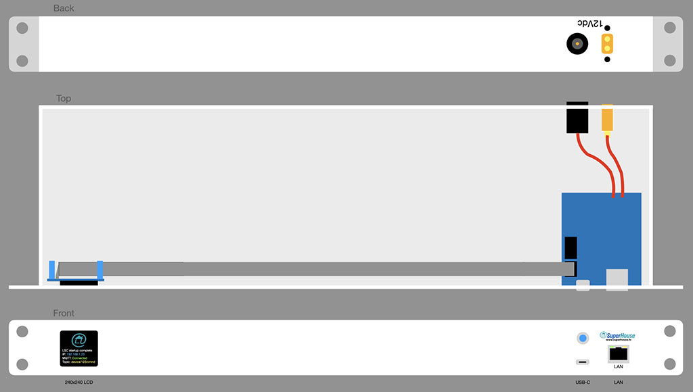

Universal Rack Controller
=========================

Copyright 2021 SuperHouse Automation Pty Ltd  www.superhouse.tv

A set of general purposes boards and mechanicals for rack mount projects.

DIY rack-mount projects often require an Ethernet connection, a
status display, power regulation, and other features that are not
specific to the project.

The Universal Rack Controller provides a set of compatible mechanicals
and modules that you can mix and match to build your own rack-mount
projects. You can either use the Rack32 ESP32-based control board
with Ethernet and PoE, or fit your own controller inside the enclosure
with connectors such as Ethernet and USB passed through the front
panel.

This allows you to use a Raspberry Pi, a Nano-ITX mobo, an Arduino,
or whatever other board best suits your needs.

Features:

 * RJ45 socket for Ethernet.
 * USB-C socket for comms or flashing firmware.
 * 1.54" SPI LCD.
 * Back-panel connectors for power.

The Rack32 board can be found at:

  https://www.superhouse.tv/rack32

More information:

  https://www.superhouse.tv/urc

INSTALLATION
------------
The design is saved as an EAGLE project. EAGLE PCB design software is
available from www.cadsoftusa.com free for non-commercial use. To use
this project download it and place the directory containing these files
into the "eagle" directory on your computer. Then open EAGLE and
navigate to the project.

CREDITS
-------
Designed by Jonathan Oxer jon@oxer.com.au

DISTRIBUTION
------------
The specific terms of distribution of this project are governed by the
license referenced below.

LICENSE
-------
Licensed under the TAPR Open Hardware License (www.tapr.org/OHL).
The "license" folder within this repository also contains a copy of
this license in plain text format.
